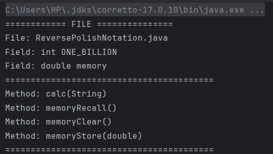
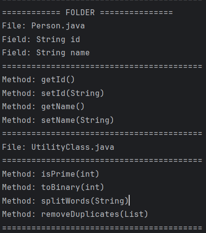
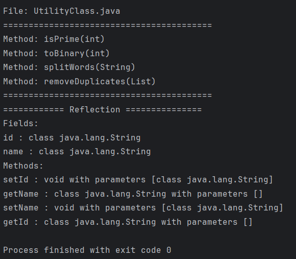

# Lab 02

### 1. Read a java source file, extract:

    a. fields
    b. methods (include parameters)

### 2. Give a folder, scan all java files (include nested folder)

    perform actions in question 1

### 3. Use java reflection to read the structure of any class (built javafile) file

