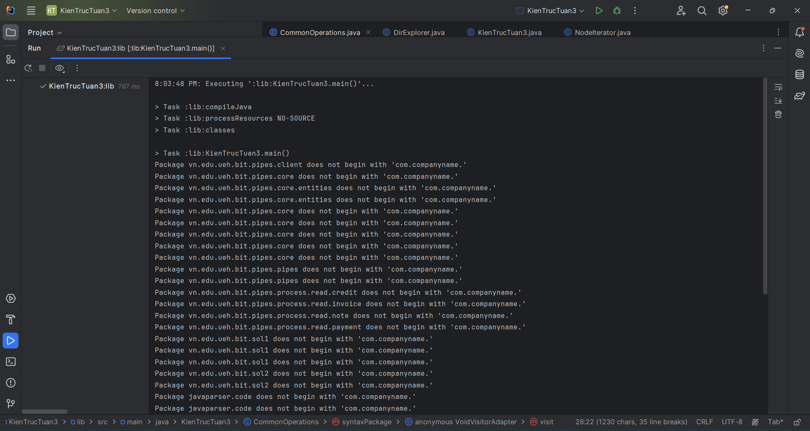
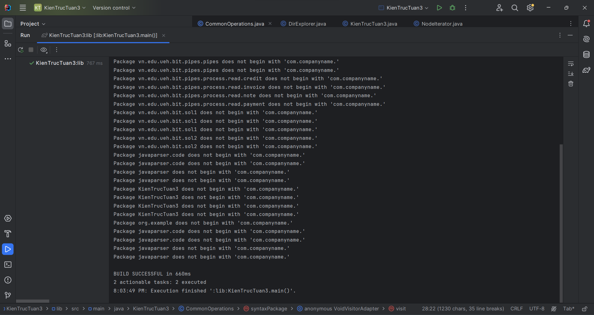

# LAB 03

Giả sử architect quyết định rằng việc tổ chức viết code phải tuân theo quy định chặt chẽ về tổ
chức và cấu trúc. Các nguyên lý được hướng dẫn như sau:

1. Các package trong dự án phải theo mẫu: com.companyname._ (_:tên bất kỳ)
2. Các class phải có tên là một danh từ hoặc cụm danh ngữ và phải bắt đầu bằng chữ hoa.
3. Mỗi lớp phải có một comment mô tả cho lớp. Trong comment đó phải có ngày tạo
   (created-date) và author.
4. Các fields trong các class phải là danh từ hoặc cụm danh ngữ và phải bắt đầu bằng một
   chữ thường.
5. Tất cả các hằng số phải là chữ viết hoa và phải nằm trong một interface.
6. Tên method phải bắt đầu bằng một động từ và phải là chữ thường
7. Mỗi method phải có một ghi chú mô tả cho công việc của method trừ phương thức
   default constructor, accessors/mutators, hashCode, equals, toString.

### Output Console

-   Console 1:
    
-   Console 2:
    
