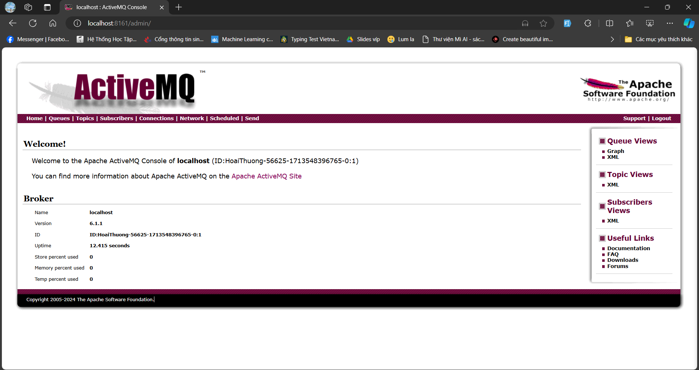

# LAB 05:

## Yêu cầu:

Giả sử bạn có một hệ thống đặt hàng từ xa. Client thông qua ứng dụng (desktop/web) gửi thông tin đặt hàng sau khi chọn lựa. Thông tin này được chuyển về dạng json và được mã hóa (có thể dùng public/private keys hoặc mã hóa theo mật khẩu hay 1 loại đơn giản nào đó)  
Để tăng hiệu suất xử lý, hệ thống sử dụng messaging service cho việc lắng nghe việc đặt hàng. Khi nhận được đơn hàng từ client, hệ thống sẽ kiểm tra số lượng trong kho có đủ không (có thể mở rộng cho trường hợp kểm tra dịch vụ giao nhận theo địa chỉ, kiểm tra năng lực thanh toán,…) sau đó quyết định đơn hàng có được xác nhận hay không.
Cho dù xác nhận hay hủy bỏ, hệ thống cũng sẽ gửi một email đến khách hàng.

## Hướng dẫn:

1. Tạo csdl cho việc lưu trữ hàng đơn giản. Có thể bao quát các yêu cầu trong 1 bảng product (với lý do là bài tập đơn giản. Thực tế thì không được làm như thế mà cần nhiều vấn đề liên quan).
   Một bảng product_order để lưu thông tin đặt hàng (mã kh,….)
2. Tải ActiveMQ , cấu hình và chạy broker.
3. Sử dụng spring data để viết các lớp theo mô hình layer để truy xuất csdl.
4. Tạo 1 dự án sử dụng spring-boot với dependency đến spring-boot-starter-activemq.

## Result:

1. Tạo Cơ Sở Dữ Liệu
   Thiết kế hai bảng đơn giản: Product và ProductOrder.

-   Bảng Product
    -   id: Khóa chính, dạng integer.
    -   name: Tên sản phẩm, dạng string.
    -   price: Giá sản phẩm, dạng double.
    -   quantity_available: Số lượng sản phẩm còn trong kho, dạng integer.
-   Bảng ProductOrder
    -   id: Khóa chính, dạng integer.
    -   product_id: Khóa ngoại liên kết với bảng Product, dạng integer.
    -   customer_id: Mã khách hàng, dạng string.
    -   quantity_ordered: Số lượng sản phẩm đặt hàng, dạng integer.
    -   order_status: Trạng thái đơn hàng (chấp nhận, từ chối), dạng string.

2. Tải ActiveMQ , cấu hình và chạy broker.

-   Tải ActiveMQ tại [đây](https://activemq.apache.org/components/classic/download/)
-   Cấu hình và chạy broker: Đi đến thư mục bin và sử dụng script activemq để chạy broker.
    -   Mở terminal và chạy lệnh: `./activemq start`
    -   Truy cập vào [localhost:8161](http://localhost:8161/admin) để kiểm tra xem ActiveMQ đã chạy chưa.
-   Kết quả:
    
