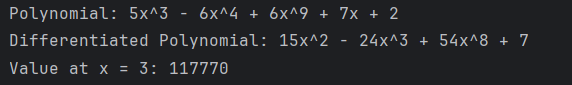

# LAB 06: Bài tập kiến trúc phần mềm pipeline

## Sử dụng kiến trúc pipeline xây dựng chương trình đạo hàm và tính giá trị đa thức
- Đầu vào là một đa thức được cho ở dạng chuỗi $ax^y -bx^z+…$  
- Ví dụ:  $5x^3 - 6x^4 + 6x^9 + 7x + 2$
- Yêu cầu:
    -	Đạo hàm đa thức
    -	Tính giá trị đa thức khi biết x

### Cách thức thực hiện
Pipeline gồm hai chức năng chính: phân tích đa thức và xử lý đa thức đã phân tích. 

1. **Phân tích đa thức (`parsePolynomial`)**:
   - Chức năng này nhận vào một chuỗi đa thức dưới dạng chuỗi và trả về một danh sách các thuật ngữ. 
   - Để thực hiện điều này, nó sử dụng một biểu thức chính quy để tìm và trích xuất các thuật ngữ từ chuỗi đa thức. 
   - Mỗi thuật ngữ được biểu diễn bằng một đối tượng `Term`, trong đó có hệ số và bậc của thuật ngữ.

2. **Xử lý đa thức đã phân tích (`differentiatePolynomial`, `polynomialToString`, `evaluatePolynomialAt`)**:
   - Sau khi phân tích xong, đa thức được chuyển qua ba chức năng xử lý khác nhau:
     - **`differentiatePolynomial`**: Đạo hàm các thuật ngữ trong đa thức. Chức năng này trả về một danh sách các thuật ngữ đã được đạo hàm.
     - **`polynomialToString`**: Chuyển đổi danh sách các thuật ngữ thành chuỗi đa thức tương ứng. Điều này làm cho đa thức trở lại dạng có thể đọc được.
     - **`evaluatePolynomialAt`**: Tính giá trị của đa thức cho một giá trị x cụ thể. Chức năng này trả về kết quả của việc thay x bằng giá trị được cung cấp trong đa thức.

3. **Kết hợp các chức năng lại với nhau (`pipelineDifferentiate`, `pipelineEvaluate`)**:
   - Hai hàm này kết hợp các chức năng trên thành các đường ống xử lý. Chúng cho phép dễ dàng áp dụng các chức năng trên một chuỗi đa thức cụ thể và lấy kết quả.
   - `pipelineDifferentiate`: Áp dụng chuỗi chức năng từ phân tích, đạo hàm, cho đến chuyển đổi thành chuỗi đa thức.
   - `pipelineEvaluate`: Áp dụng chuỗi chức năng từ phân tích đến tính giá trị đa thức tại một giá trị x cụ thể. 

- Code thực thi:

- Kết quả:

## Quy trình thực hiện

